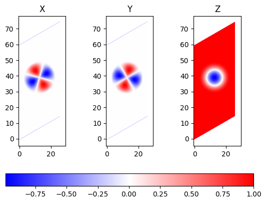

## Skyrmionok szimulációja és vizualizációja a SPIRIT package használatával

|          | $Q = 1$ |$ Q = 2 $|
|----------|-------|-------|
| ALAP     |     |      |
| $B = 10 T, J_1 = 20,  J_2 = -8 $|       |       |
| $B = 5 T, J_1 = 20, J_2 = -8$ |       |       |
