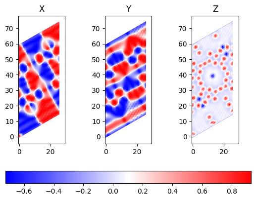
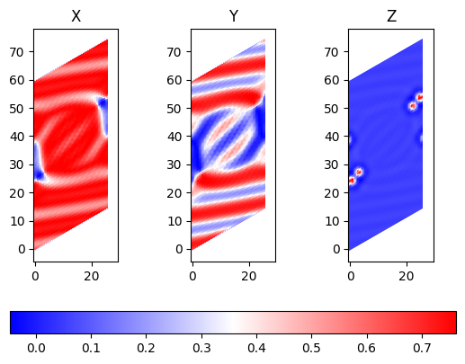
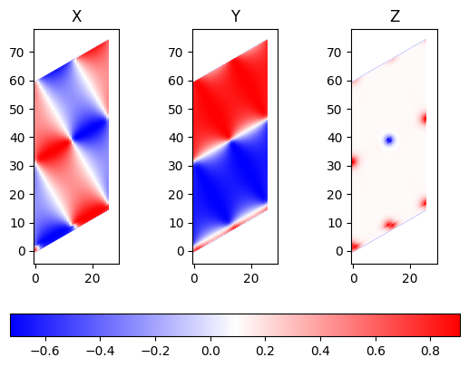
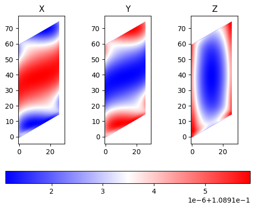

## Skyrmionok szimulációja és vizualizációja a SPIRIT package használatával

A projekt 3 fontos fájlból áll: data/config.cfg-ből, ami a bemeneti paramétereket tartalmazza, sim.ipynb-ből ami elvégzi a szimulációt és a vis.ipynb-ből ami vizualizálja az eredményt. 

Néhány eredmény:

|          | $Q = 1$ |$ Q = 2 $|
|----------|-------|-------|
| ALAP     |     |     |
| $B = 10 T, J_1 = 20,  J_2 = -8 $|        |       |
| $B = 5 T, J_1 = 20, J_2 = -8$ |       |       |
